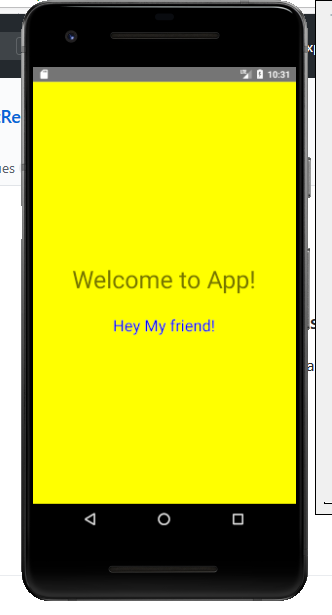

# FirstReactNative

A sample application created using **React Native** and tested on the **Android**.



### Insatll

```sh
$ npm install -g react-native-cli
$ react-native init FirstReactNative
$ cd FirstReactNative
```

### Run

- Run your emulator or connect your device
- Check device list and status. (It should was device, not offline)
- Run App by (`$ react-native run-android`)
- Test App

### Editor Plugins

There are some plugins for the sublime text.

Such as :

- https://github.com/facebookarchive/sublime-react
- https://github.com/babel/babel-sublime
